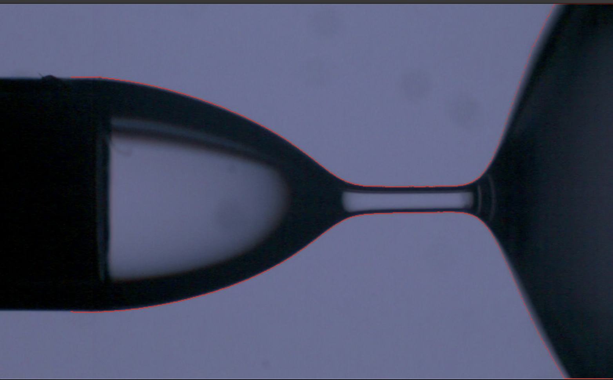
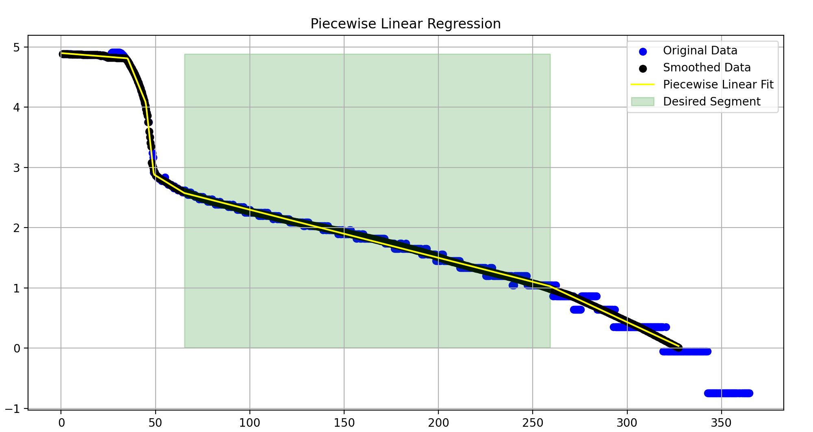

# DoS Analysis Tool

### Click [here](#instructions) to jump to  instructions.

## Brief Overview

Software tool developed for the [Frostad Research Group](https://food.chbe.ubc.ca/). Measures the width of the droplet at it's narrowest point. Automatically finds the desired linear part and finds it's slope after smoothing the data. For extremely low concentrations of most compounds used, there is also a tool to manually change the slope (if necessary) using a GUI.

## Measurement
The `MeasureWidths` function `measure.py` gives the lowest measurement of the width in each frame. It checks each measurement to verify its accuracy before adding it to the dataset. The measurement is reliant on binarizing each frame and the threshold is automatically calculated from the points in the image.

## Finding the Slope
The data is smoothed using a custom function (in `analyze.py`) that connects the centers of each step and interpolates points between them to account for missing values that could affect the linear fit. 

The `pwlf` library is used to fit a piecewise linear regression on the data and the appropriate slope is selected [1]. Differential evolution is used to find the breakpoints for the data. More information and detailed workings of the library can be found [here](https://jekel.me/piecewise_linear_fit_py/how_it_works.html).

**Flagging bad data -** Bad data is flagged automatically based on the sparsity of points in the last 20% of the data. The data is standardized before measuring for sparsity.

## Instructions 

1. Add the input parameters - 
   - Frames-per-second of the camera.
   - Needle width used.
   - Rows to skip, which is the number of rows that are skipped in each frame.
   - Show value. Set to `True` to show the video being processed and the plot with overlay.
   - Breaks, which is the number of segments for the piecewise linear fit. The default is 6.
   - Run `main.py` to start the process.

2. Allow time to process the files. The progress will be displayed in the console. File names will be shown as they are finished processing. The number of files processed will be shown. And the number of files with bad data will be shown, typically files with very low concentration. You can identify bad data as folders starting with `0_FLAG_`. 

5. You will be asked if you'd like to verify the results. Once, you click yes, a GUI opens up.
   - Browse the directory of the processed files.
   - Iterate through the files through the GUI (`next` and `previous` buttons). The generated plots are shown.
   - If an overlay plot looks wrong, click `rework` and it loads the data.
   - Use left click for the start time and right click for the stop time.
   - Click `fit` to re-fit a slope to the data.
   - Click `save` to save changes to the generated output file (SLOPE_DATA.csv).
  
## Workflow

| 1. Measure => | 2. Get Data => | 3. Smoothening =>| 4. Piecewise Linear Fit => | 5. Slope => | 6. Flagging => | 7. Manual Verification (Optional) |
|---------------|----------------| ----------------|----------------| ----------------|----------------|----------------|

Steps 1 through 6 are done for every file in the specified directory automatically. Step 7 is done for every file manually through a GUI and is intended for flagged files.

## References
[1]
Charles F. Jekel, Gerhard Venter, "A Python Library for Fitting 1D Continuous Piecewise Linear Functions". Available Online [here](https://jekel.me/piecewise_linear_fit_py/how_it_works.html).
